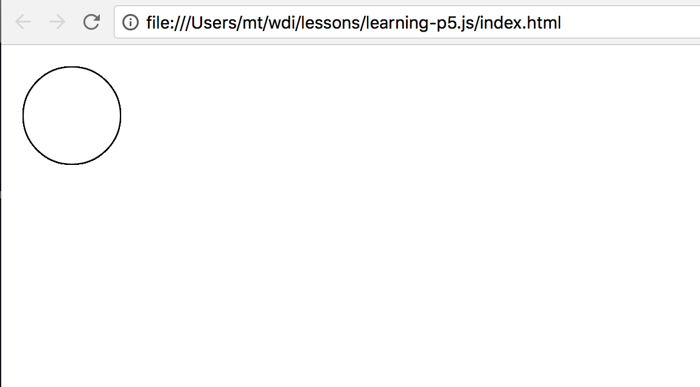
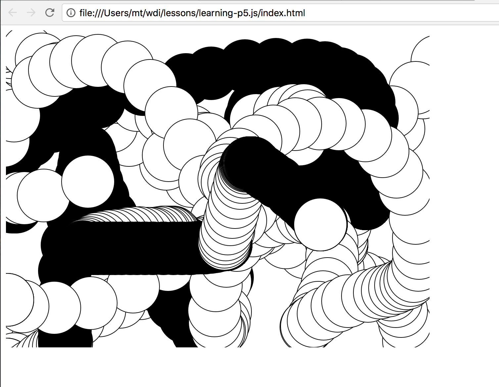

# learning-p5.js

## Getting Started
* In a folder, make an ```index.html``` and a ```sketch.js``` file
* You have two ways to link the p5.js library to ```index.html```:
   1. Download the p5.js library and link it in your folder
   2. Link to a p5.js file hosted online
* If you chose to link to a p5.js file hosted online like I did for this, add

   ```<script src="https://cdnjs.cloudflare.com/ajax/libs/p5.js/0.6.1/p5.js"></script>```

   to the head of ```index.html```.  And also link ```sketch.js``` to ```index.html```
* ```index.html``` should look like this
```
<!DOCTYPE html>
<html lang="en">
<head>
  <meta charset="UTF-8">
  <meta name="viewport" content="width=device-width, initial-scale=1.0">
  <meta http-equiv="X-UA-Compatible" content="ie=edge">
  <script src="https://cdnjs.cloudflare.com/ajax/libs/p5.js/0.6.1/p5.js"></script>
  <script src="sketch.js"></script>
  <title>Document</title>
</head>
<body>
  
</body>
</html>
```

## Make a circle
Let's see if everything is linked up correctly.  We'll have a circle appear.  In ```sketch.js```, add the following:

```
function setup () {

}

function draw () {
  ellipse(50, 50, 80, 80)
}
```

The setup() function is called once when the program starts. It's used to define initial environment properties such as screen size and background color and to load media such as images and fonts as the program starts. There can only be one setup() function for each program and it shouldn't be called again after its initial execution. 

The draw() function means "draw an ellipse, with the center 50 pixels over from the left and 50 pixels down from the top, with a width and height of 80 pixels".

Open ```index.html``` in your browser and if you see a circle, you're doing great.



## Make a canvas
Let's try making a canvas and draw circles wherever the mouse goes on the canvas.  Change the code in ```sketch.js``` to this:

```
function setup () {
  createCanvas(640, 480)
}

function draw () {
  if (mouseIsPressed) {
    fill(0)
  } else {
    fill(255)
  }
  ellipse(mouseX, mouseY, 80, 80)
}
```

You'll see something like this


## Resources
* https://p5js.org/
* https://p5js.org/get-started/
* https://p5js.org/download/ (for downloading the p5.js library)
* https://cdnjs.com/libraries/p5.js (for linking to a p5.js file hosted online)
* https://p5js.org/reference/